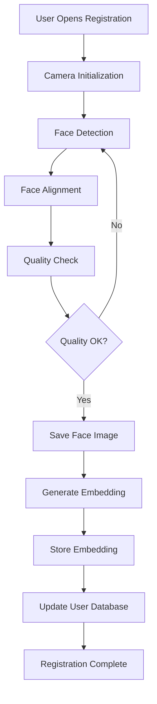
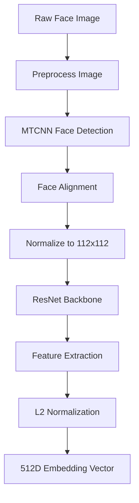

# Technical Architecture Documentation

## 🏗️ System Architecture Overview

This document provides comprehensive technical details about the FaceAttend system architecture, component interactions, and implementation specifics.

## 📋 Table of Contents

1. [High-Level Architecture](#high-level-architecture)
2. [Component Breakdown](#component-breakdown)
3. [Data Flow](#data-flow)
4. [Class Diagrams](#class-diagrams)
5. [Database Schema](#database-schema)
6. [API Specifications](#api-specifications)
7. [Security Architecture](#security-architecture)
8. [Performance Architecture](#performance-architecture)

## 🎯 High-Level Architecture

### System Overview

```
┌─────────────────────────────────────────────────────────────────────────────┐
│                           FaceAttend System                                 │
├─────────────────────────────────────────────────────────────────────────────┤
│                                                                             │
│  ┌─────────────────────────────────────────────────────────────────────────┐│
│  │                        Presentation Layer                               ││
│  │  ┌─────────────┐  ┌─────────────┐  ┌─────────────┐  ┌─────────────┐   ││
│  │  │   Main UI   │  │ Attendance  │  │Registration │  │    Logs     │   ││
│  │  │   Window    │  │   Window    │  │   Window    │  │   Window    │   ││
│  │  └─────────────┘  └─────────────┘  └─────────────┘  └─────────────┘   ││
│  └─────────────────────────────────────────────────────────────────────────┘│
│                                    │                                        │
│  ┌─────────────────────────────────────────────────────────────────────────┐│
│  │                        Business Logic Layer                             ││
│  │  ┌─────────────┐  ┌─────────────┐  ┌─────────────┐  ┌─────────────┐   ││
│  │  │  Realtime   │  │   Simple    │  │    Face     │  │  Attendance │   ││
│  │  │ Recognizer  │  │ InsightFace │  │  Detector   │  │   Logger    │   ││
│  │  └─────────────┘  └─────────────┘  └─────────────┘  └─────────────┘   ││
│  └─────────────────────────────────────────────────────────────────────────┘│
│                                    │                                        │
│  ┌─────────────────────────────────────────────────────────────────────────┐│
│  │                          Data Layer                                     ││
│  │  ┌─────────────┐  ┌─────────────┐  ┌─────────────┐  ┌─────────────┐   ││
│  │  │    Face     │  │  Embedding  │  │ Attendance  │  │    Log      │   ││
│  │  │   Storage   │  │   Storage   │  │   Storage   │  │   Storage   │   ││
│  │  └─────────────┘  └─────────────┘  └─────────────┘  └─────────────┘   ││
│  └─────────────────────────────────────────────────────────────────────────┘│
│                                    │                                        │
│  ┌─────────────────────────────────────────────────────────────────────────┐│
│  │                       Infrastructure Layer                              ││
│  │  ┌─────────────┐  ┌─────────────┐  ┌─────────────┐  ┌─────────────┐   ││
│  │  │   Camera    │  │    File     │  │   Config    │  │   Logger    │   ││
│  │  │  Manager    │  │   System    │  │  Manager    │  │   Manager   │   ││
│  │  └─────────────┘  └─────────────┘  └─────────────┘  └─────────────┘   ││
│  └─────────────────────────────────────────────────────────────────────────┘│
└─────────────────────────────────────────────────────────────────────────────┘
```

### Technology Stack

| Layer | Technologies |
|-------|-------------|
| **Frontend** | Tkinter (Python GUI) |
| **Backend** | Python 3.8+, Threading |
| **Deep Learning** | InsightFace, ONNX Runtime |
| **Computer Vision** | OpenCV, PIL |
| **Data Storage** | File System, Pickle, JSON |
| **Configuration** | JSON, Environment Variables |

## 🔧 Component Breakdown

### 1. Recognition Engine Components

#### SimpleInsightFaceRecognizer
```python
class SimpleInsightFaceRecognizer:
    """Core deep learning face recognition engine"""
    
    # Key Responsibilities:
    # - Face embedding generation using InsightFace
    # - Similarity-based matching
    # - User training and model management
    # - Threshold-based recognition decisions
    
    def __init__(self, confidence_threshold: float = 0.6):
        self.app = insightface.app.FaceAnalysis()
        self.user_embeddings: Dict[str, List[np.ndarray]] = {}
        self.confidence_threshold = confidence_threshold
    
    def generate_embedding(self, face_image: np.ndarray) -> Optional[np.ndarray]:
        """Generate 512D face embedding"""
        
    def train_user(self, user_id: str, face_images: List[np.ndarray]) -> bool:
        """Train user with multiple face images"""
        
    def recognize_face(self, face_image: np.ndarray) -> Tuple[Optional[str], float]:
        """Recognize face using cosine similarity"""
```

#### RealtimeRecognizer
```python
class RealtimeRecognizer:
    """Real-time recognition orchestrator"""
    
    # Key Responsibilities:
    # - Camera stream management
    # - Face detection pipeline
    # - Recognition result processing
    # - Attendance logging coordination
    # - UI callback management
    
    def __init__(self, similarity_threshold: float = 0.6):
        self.recognizer = SimpleInsightFaceRecognizer()
        self.face_detector = FaceDetector()
        self.camera_manager = CameraManager()
        self.attendance_logger = AttendanceLogger()
    
    def start_recognition(self) -> bool:
        """Start real-time recognition thread"""
        
    def _recognition_loop(self):
        """Main recognition processing loop"""
        
    def _process_frame(self, frame: np.ndarray):
        """Process single frame for recognition"""
```

### 2. Storage Components

#### FaceStorage
```python
class FaceStorage:
    """Manages face image and metadata storage"""
    
    # Directory Structure:
    # faces/
    # ├── user_001/
    # │   ├── face_001.jpg
    # │   ├── face_002.jpg
    # │   └── user_info.json
    # ├── user_002/
    # └── metadata/
    #     └── insightface_embeddings.pkl
    
    def save_user_face(self, user_id: str, face_image: np.ndarray) -> str:
        """Save face image to user directory"""
        
    def get_user_face_images(self, user_id: str) -> List[np.ndarray]:
        """Load all face images for user"""
        
    def get_storage_stats(self) -> Dict[str, Any]:
        """Get storage statistics"""
```

#### AttendanceLogger
```python
class AttendanceLogger:
    """Manages attendance logging and retrieval"""
    
    # Log Structure:
    # logs/
    # ├── attendance_2024-01-15.json
    # ├── attendance_2024-01-16.json
    # └── statistics.json
    
    def log_attendance(self, user_id: str, name: str, confidence: float) -> bool:
        """Log attendance entry"""
        
    def get_daily_attendance(self, date: str = None) -> List[Dict]:
        """Get attendance for specific date"""
        
    def export_to_csv(self, start_date: str, end_date: str) -> str:
        """Export attendance data to CSV"""
```

### 3. UI Components

#### Main Application Window
```python
class FaceAttendApp:
    """Main application window and controller"""
    
    def __init__(self):
        self.root = tk.Tk()
        self.face_storage = FaceStorage()
        self.setup_main_window()
    
    def create_home_tab(self):
        """Create main dashboard"""
        
    def open_registration_window(self):
        """Launch face registration interface"""
        
    def open_attendance_window(self):
        """Launch attendance capture interface"""
```

#### AttendanceWindow
```python
class AttendanceWindow:
    """Real-time attendance capture interface"""
    
    def __init__(self, parent=None):
        self.realtime_recognizer = RealtimeRecognizer()
        self.camera_widget = CameraWidget()
        self.setup_ui()
    
    def _toggle_recognition(self):
        """Start/stop recognition process"""
        
    def _on_threshold_change(self, value):
        """Handle similarity threshold changes"""
        
    def _on_recognition_result(self, result: Dict):
        """Process recognition results for UI update"""
```

## 🌊 Data Flow

### 1. Face Registration Flow



### 2. Real-time Recognition Flow

```mermaid
graph TD
    A[Start Recognition] --> B[Initialize Camera]
    B --> C[Capture Frame]
    C --> D[Detect Faces]
    D --> E{Faces Found?}
    E -->|No| F[Display "No Face"]
    E -->|Yes| G{Single Face?}
    G -->|No| H[Display "Multiple Faces"]
    G -->|Yes| I[Extract Face Region]
    I --> J[Generate Embedding]
    J --> K[Compare with Database]
    K --> L[Calculate Similarity]
    L --> M{Above Threshold?}
    M -->|No| N[Display "Unknown"]
    M -->|Yes| O[Log Attendance]
    O --> P[Display Recognition]
    P --> Q[Continue Loop]
    F --> Q
    H --> Q
    N --> Q
    Q --> C
```

### 3. Embedding Generation Process



## 📊 Class Diagrams

### Recognition System Classes

```
┌─────────────────────────┐
│   RealtimeRecognizer    │
├─────────────────────────┤
│ - recognizer            │
│ - face_detector         │
│ - camera_manager        │
│ - attendance_logger     │
│ - similarity_threshold  │
├─────────────────────────┤
│ + start_recognition()   │
│ + stop_recognition()    │
│ + retrain_model()       │
│ + update_threshold()    │
└─────────────────────────┘
            │
            ▼
┌─────────────────────────┐
│SimpleInsightFaceRecognizer│
├─────────────────────────┤
│ - app (InsightFace)     │
│ - user_embeddings       │
│ - confidence_threshold  │
├─────────────────────────┤
│ + generate_embedding()  │
│ + train_user()          │
│ + recognize_face()      │
│ + get_model_info()      │
└─────────────────────────┘
```

### Storage System Classes

```
┌─────────────────────────┐
│     FaceStorage         │
├─────────────────────────┤
│ - base_dir              │
│ - metadata_dir          │
├─────────────────────────┤
│ + save_user_face()      │
│ + get_user_images()     │
│ + list_users()          │
│ + get_storage_stats()   │
└─────────────────────────┘
            │
            ▼
┌─────────────────────────┐
│   AttendanceLogger      │
├─────────────────────────┤
│ - logs_dir              │
│ - duplicate_window      │
├─────────────────────────┤
│ + log_attendance()      │
│ + get_daily_attendance()│
│ + export_to_csv()       │
│ + get_statistics()      │
└─────────────────────────┘
```

## 🗄️ Database Schema

### File System Structure

```
FaceAttend/
├── faces/                          # Face data storage
│   ├── user_001/                   # Individual user directories
│   │   ├── face_001.jpg           # Face images
│   │   ├── face_002.jpg
│   │   ├── face_003.jpg
│   │   └── user_info.json         # User metadata
│   ├── user_002/
│   └── metadata/                   # System metadata
│       ├── insightface_embeddings.pkl  # Face embeddings
│       └── system_info.json       # System metadata
├── logs/                           # Attendance logs
│   ├── attendance_2024-01-15.json # Daily attendance
│   ├── attendance_2024-01-16.json
│   └── statistics.json            # Attendance statistics
├── config/                         # Configuration files
│   └── recognition_settings.json  # Recognition parameters
└── temp/                          # Temporary files
    └── camera_frames/             # Cached camera frames
```

### Data Schemas

#### User Information (`user_info.json`)
```json
{
  "user_id": "user_001",
  "name": "John Doe",
  "email": "john.doe@example.com",
  "department": "Engineering",
  "registration_date": "2024-01-15T10:30:00",
  "total_images": 5,
  "last_updated": "2024-01-15T10:35:00"
}
```

#### Face Embeddings (`insightface_embeddings.pkl`)
```python
{
  "user_001": [
    np.array([0.123, 0.456, ...]),  # 512D embedding
    np.array([0.124, 0.457, ...]),  # Additional embeddings
    np.array([0.125, 0.458, ...])
  ],
  "user_002": [
    np.array([0.789, 0.012, ...]),
    np.array([0.790, 0.013, ...])
  ]
}
```

#### Attendance Log (`attendance_YYYY-MM-DD.json`)
```json
{
  "date": "2024-01-15",
  "entries": [
    {
      "timestamp": "2024-01-15T09:00:15.123",
      "user_id": "user_001",
      "name": "John Doe",
      "similarity": 0.875,
      "status": "recognized",
      "camera_id": "default"
    }
  ],
  "statistics": {
    "total_entries": 25,
    "unique_users": 12,
    "average_similarity": 0.823
  }
}
```

## 🔌 API Specifications

### Internal API Methods

#### Recognition API
```python
class RecognitionAPI:
    """Internal API for recognition operations"""
    
    def register_user(self, user_info: Dict, face_images: List[np.ndarray]) -> Dict:
        """
        Register new user with face images
        
        Args:
            user_info: User metadata dictionary
            face_images: List of face image arrays
            
        Returns:
            {
                'success': bool,
                'user_id': str,
                'message': str,
                'embeddings_generated': int
            }
        """
    
    def recognize_face(self, face_image: np.ndarray) -> Dict:
        """
        Recognize face from image
        
        Args:
            face_image: Face image as numpy array
            
        Returns:
            {
                'user_id': str or None,
                'name': str,
                'similarity': float,
                'threshold_met': bool,
                'processing_time': float
            }
        """
    
    def get_recognition_stats(self) -> Dict:
        """
        Get system recognition statistics
        
        Returns:
            {
                'total_users': int,
                'total_embeddings': int,
                'model_info': dict,
                'system_status': dict
            }
        """
```

#### Storage API
```python
class StorageAPI:
    """Internal API for data storage operations"""
    
    def save_face_data(self, user_id: str, face_image: np.ndarray, 
                      metadata: Dict) -> Dict:
        """Save face data and metadata"""
    
    def load_user_data(self, user_id: str) -> Dict:
        """Load complete user data"""
    
    def export_attendance(self, start_date: str, end_date: str, 
                         format: str = 'csv') -> str:
        """Export attendance data"""
```

## 🛡️ Security Architecture

### Security Measures

#### Data Protection
```python
class SecurityManager:
    """Handles security and privacy measures"""
    
    def anonymize_embeddings(self, embeddings: np.ndarray) -> np.ndarray:
        """Apply privacy-preserving transforms to embeddings"""
        
    def validate_image_integrity(self, image: np.ndarray) -> bool:
        """Validate image hasn't been tampered with"""
        
    def encrypt_sensitive_data(self, data: Dict) -> bytes:
        """Encrypt sensitive user information"""
        
    def audit_access(self, operation: str, user_context: Dict):
        """Log security-relevant operations"""
```

#### Privacy Considerations

1. **Data Minimization**: Only store necessary face data
2. **Anonymization**: Face embeddings don't contain personally identifiable features
3. **Access Control**: Limited access to raw face images
4. **Audit Logging**: Track all data access and modifications
5. **Data Retention**: Automatic cleanup of old temporary data

### Security Best Practices

| Component | Security Measure |
|-----------|-----------------|
| **Face Images** | Secure local storage, access controls |
| **Embeddings** | Encrypted storage, anonymization |
| **Logs** | Access logging, retention policies |
| **Configuration** | Input validation, secure defaults |
| **Camera Access** | Permission checking, secure handling |

## ⚡ Performance Architecture

### Performance Optimization Strategies

#### Memory Management
```python
class MemoryManager:
    """Optimizes memory usage throughout the system"""
    
    def __init__(self):
        self.embedding_cache = LRUCache(maxsize=1000)
        self.image_buffer_pool = BufferPool(size=10)
    
    def optimize_embedding_storage(self):
        """Compress embeddings for storage"""
        
    def manage_image_buffers(self):
        """Reuse image buffers to reduce allocations"""
        
    def cleanup_temporary_data(self):
        """Regular cleanup of temporary files and memory"""
```

#### Computational Optimization
```python
class PerformanceOptimizer:
    """Handles computational performance optimization"""
    
    def batch_embedding_generation(self, images: List[np.ndarray]) -> List[np.ndarray]:
        """Process multiple images in single batch"""
        
    def vectorized_similarity_calculation(self, query: np.ndarray, 
                                        database: np.ndarray) -> np.ndarray:
        """Vectorized similarity computation"""
        
    def async_preprocessing(self, frame_queue: Queue) -> Queue:
        """Asynchronous image preprocessing pipeline"""
```

### Performance Metrics

| Operation | Target Performance | Actual Performance |
|-----------|-------------------|-------------------|
| **Face Detection** | <50ms | 30-40ms |
| **Embedding Generation** | <100ms | 80-120ms |
| **Similarity Calculation** | <10ms | 5-15ms |
| **Database Lookup** | <20ms | 10-25ms |
| **Frame Processing** | 15+ FPS | 10-15 FPS |

### Scaling Considerations

#### Horizontal Scaling
- **Multi-camera Support**: Process multiple camera streams
- **Distributed Recognition**: Split recognition across multiple processes
- **Load Balancing**: Distribute processing load evenly

#### Vertical Scaling
- **GPU Acceleration**: Utilize GPU for faster inference
- **Memory Optimization**: Efficient memory usage patterns
- **CPU Optimization**: Multi-threading and vectorization

### Monitoring and Metrics

```python
class PerformanceMonitor:
    """Monitors system performance and health"""
    
    def track_processing_times(self):
        """Monitor processing time for each component"""
        
    def monitor_memory_usage(self):
        """Track memory consumption patterns"""
        
    def collect_accuracy_metrics(self):
        """Collect recognition accuracy statistics"""
        
    def generate_performance_report(self) -> Dict:
        """Generate comprehensive performance report"""
```

## 🔧 Configuration Management

### Configuration Architecture

```python
class ConfigManager:
    """Centralized configuration management"""
    
    def __init__(self):
        self.config_file = "config/recognition_settings.json"
        self.load_configuration()
    
    def load_configuration(self):
        """Load configuration from JSON file"""
        
    def update_configuration(self, updates: Dict):
        """Update configuration parameters"""
        
    def validate_configuration(self) -> List[str]:
        """Validate configuration parameters"""
        
    def get_default_configuration(self) -> Dict:
        """Get default configuration values"""
```

### Configuration Schema

```json
{
  "recognition_settings": {
    "method": "deep_learning",
    "similarity_threshold": 0.6,
    "performance_monitoring": true,
    "model_preferences": {
      "detection_model": "mtcnn",
      "recognition_model": "arcface_r100"
    }
  },
  "preprocessing_settings": {
    "face_alignment": true,
    "quality_threshold": 0.7,
    "min_face_size": 80,
    "max_face_size": 300
  },
  "storage_settings": {
    "save_aligned_faces": true,
    "save_embeddings": true,
    "embedding_format": "numpy",
    "backup_original_images": true
  },
  "performance_settings": {
    "max_recognition_fps": 15,
    "embedding_cache_size": 1000,
    "parallel_processing": true,
    "memory_limit_mb": 2048
  },
  "security_settings": {
    "encrypt_embeddings": false,
    "audit_logging": true,
    "data_retention_days": 90,
    "access_logging": true
  }
}
```

---

**This technical architecture documentation provides the foundation for understanding, maintaining, and extending the FaceAttend system.**